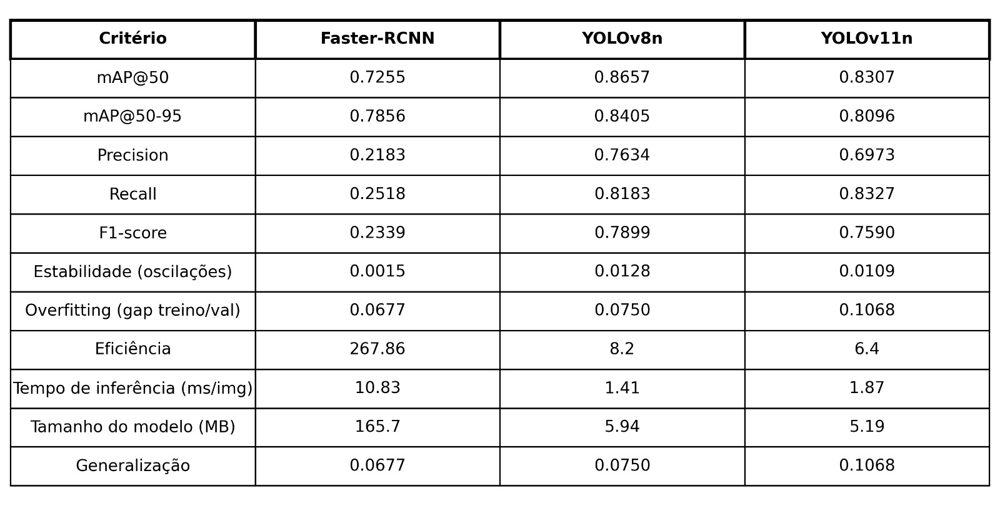

# Detecção de Defeitos em Frutas e Hortaliças com YOLOv8, YOLOv11 e Faster R-CNN

## Descrição do Projeto

Este projeto utiliza redes neurais YOLOv8, YOLOv11 e Faster R-CNN (FRCNN) para realizar a detecção automática de defeitos em frutas e hortaliças. O objetivo é classificar e localizar frutas boas (**fresh**) e defeituosas (**rotten**) para auxiliar em processos automatizados de inspeção de qualidade.

O pipeline inclui:
- **Preparação do dataset**: Organização e rotulação de imagens.
- **Treinamento dos modelos YOLO e FRCNN**: Configuração e execução do treinamento.
- **Avaliação dos modelos**: Comparação de métricas como precisão, revocação e mAP.
- **Visualização de resultados**: Gráficos e tabelas comparativas.

---

## Estrutura do Repositório

```plaintext
visao_computacional/
├── [af_ia_frcnn.ipynb]         # Notebook para treinamento do modelo Faster R-CNN
├── [af_ia_yolo.ipynb]          # Notebook principal do projeto YOLO
├── [README.md]                 # Documentação do projeto
├── dataset_train/              # Dataset de treino principal
│   ├── fresh_apple/
│   ├── fresh_banana/
│   ├── fresh_orange/
│   ├── rotten_apple/
│   ├── rotten_banana/
│   ├── rotten_orange/
├── dataset_train2/             # Dataset de treino adicional
│   ├── fresh_apple/
│   ├── fresh_banana/
│   ├── fresh_orange/
│   ├── rotten_apple/
│   ├── rotten_banana/
│   ├── rotten_orange/
├── dataset_val/                # Dataset de validação
│   ├── fresh_apple/
│   ├── fresh_banana/
│   ├── fresh_orange/
│   ├── rotten_apple/
│   ├── rotten_banana/
│   ├── rotten_orange/
├── runs/                       # Resultados dos treinamentos
│   ├── frcnn_training/         # Resultados do modelo FRCNN
│   ├── train_fruit_v8n/        # Resultados do YOLOv8
│   ├── train_fruit_v11n/       # Resultados do YOLOv11
```

--- 

## Download dos Datasets

Os datasets utilizados neste projeto estão disponíveis no Google Drive e Kaggle. Para baixá-los, siga os links abaixo:

- [Dataset de Treino Principal] (https://data.mendeley.com/datasets/xkbjx8959c/2)
- [Dataset de Treino Adicional] (https://data.mendeley.com/datasets/bdd69gyhv8/1)
- [Dataset de Validação] (https://www.kaggle.com/datasets/zlatan599/fruitquality1?resource=download)

Após o download, organize os datasets conforme a estrutura abaixo:

```plaintext
visao_computacional/
├── dataset_train/
│   ├── fresh_apple/
│   ├── fresh_banana/
│   ├── fresh_orange/
│   ├── rotten_apple/
│   ├── rotten_banana/
│   ├── rotten_orange/
├── dataset_train2/
│   ├── fresh_apple/
│   ├── fresh_banana/
│   ├── fresh_orange/
│   ├── rotten_apple/
│   ├── rotten_banana/
│   ├── rotten_orange/
├── dataset_val/
│   ├── fresh_apple/
│   ├── fresh_banana/
│   ├── fresh_orange/
│   ├── rotten_apple/
│   ├── rotten_banana/
│   ├── rotten_orange/
```

---

## Comparação de Modelos

A tabela abaixo apresenta uma comparação detalhada entre os modelos Faster-RCNN, YOLOv8 e YOLOv11 com base em métricas como precisão, revocação, eficiência e generalização:



### Descrição da Tabela
- **mAP@50 e mAP@50-95**: Métricas de precisão média para avaliar a qualidade da detecção.
- **Precision e Recall**: Indicadores de quão bem os modelos identificam corretamente os defeitos e evitam falsos positivos.
- **F1-score**: Combinação de precisão e revocação para medir o desempenho geral.
- **Estabilidade e Overfitting**: Avaliação de oscilações durante o treinamento e diferença entre desempenho em treino e validação.
- **Eficiência e Tempo de Inferência**: Tempo necessário para processar uma imagem e eficiência geral do modelo.
- **Tamanho do Modelo**: Espaço ocupado pelo modelo treinado.
- **Generalização**: Capacidade do modelo de se adaptar a novos dados.

---

## Conclusão

Este projeto demonstra como redes neurais avançadas podem ser aplicadas para resolver problemas reais de inspeção de qualidade em frutas e hortaliças. A comparação entre os modelos YOLOv8, YOLOv11 e Faster-RCNN fornece insights valiosos para escolher o modelo mais adequado dependendo das necessidades específicas de precisão, eficiência e generalização.
